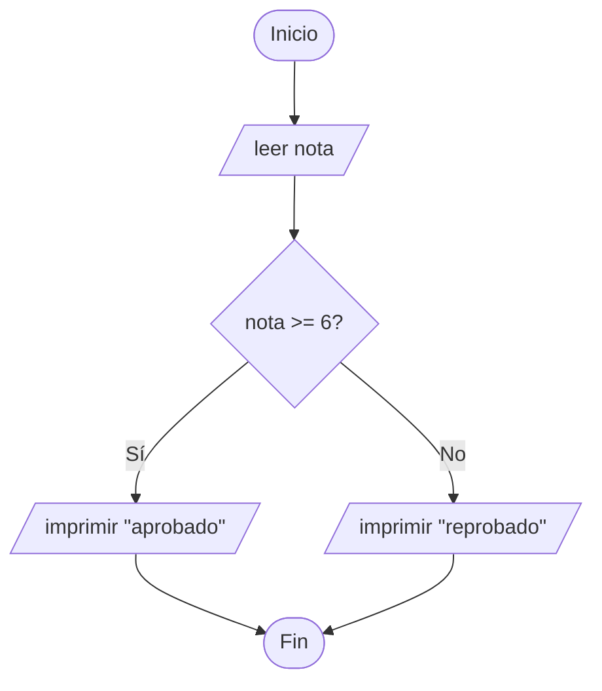

# Módulo 3 · Diagramas de flujo

> ⏱️ **Duración:** 60 min · 📊 **Insignia:** Visualizador · ⚡ **75 XP**

---

## 1. ¿Por qué dibujar un algoritmo?

El pseudocódigo es lineal. Los diagramas de flujo son **espaciales**. Te permiten ver de un vistazo:

- Por dónde empieza y termina tu programa.
- Dónde se bifurca la ejecución.
- Dónde hay ciclos que se repiten.

Cuando un problema es grande o tiene muchas decisiones, el diagrama de flujo te salva de perderte. Muchos equipos profesionales los dibujan **antes de escribir una sola línea de código** para alinear expectativas.

---

## 2. Los símbolos estándar (ISO 5807)

Son pocos y se usan en todo el mundo. Memorízalos bien:

### 🔵 Óvalo — Inicio / Fin
Marca el principio y el final del programa. Cada diagrama tiene exactamente uno de cada.

```
   ╭─────────╮
  (  INICIO  )
   ╰─────────╯
```

### ▭ Rectángulo — Proceso
Cualquier acción o cálculo: asignar un valor, sumar, multiplicar, llamar a otra rutina.

```
  ┌─────────────┐
  │ total ← a+b │
  └─────────────┘
```

### 🔷 Rombo — Decisión
Una pregunta con dos salidas posibles: Sí / No (o Verdadero / Falso). Siempre tiene **una flecha de entrada y dos de salida**.

```
       ╱╲
      ╱  ╲
     ╱ a>b ╲───► Sí
     ╲    ╱
      ╲  ╱
       ╲╱
        │
        ▼ No
```

### ▱ Paralelogramo — Entrada / Salida
Cuando pides datos al usuario (`leer`) o los imprimes en pantalla (`mostrar`).

```
   ╱────────────╱
  ╱  leer edad ╱
  ────────────
```

### ⬇️ Flechas — Flujo de ejecución
Indican hacia dónde va el programa después de cada paso. Siempre con sentido claro, de arriba hacia abajo y de izquierda a derecha por convención.

---

## 3. Las tres estructuras fundamentales

**Todo programa del mundo, desde Instagram hasta Excel, se construye combinando estas tres.**

### 3.1 Secuencia

Un paso detrás del otro, sin bifurcaciones.

```
  ( INICIO )
      │
      ▼
  ┌───────────┐
  │ leer a    │
  └───────────┘
      │
      ▼
  ┌───────────┐
  │ leer b    │
  └───────────┘
      │
      ▼
  ┌───────────┐
  │ c ← a + b │
  └───────────┘
      │
      ▼
  ╱────────╱
 ╱ mostrar c
 ────────
      │
      ▼
   (  FIN  )
```

### 3.2 Decisión (condicional)

El programa elige un camino según una condición.

```
  ( INICIO )
      │
      ▼
  ╱──────────╱
 ╱ leer edad ╱
 ──────────
      │
      ▼
     ╱╲
    ╱  ╲     Sí    ╱─────────────────╱
   ╱ ≥ ╲ ─────────► "mayor de edad" ╱
   ╲ 18 ╱         ─────────────────
    ╲  ╱
     ╲╱
      │ No
      ▼
  ╱─────────────────╱
 ╱ "menor de edad" ╱
 ─────────────────
      │
      ▼
   (  FIN  )
```

### 3.3 Repetición (ciclo)

El programa vuelve atrás mientras se cumpla una condición.

```
  ( INICIO )
      │
      ▼
  ┌───────────┐
  │ i ← 1     │
  └───────────┘
      │
      ▼  ◄──────────┐
     ╱╲              │
    ╱  ╲   Sí         │
   ╱i≤10╲ ──► imprimir i
   ╲    ╱        │
    ╲  ╱         ▼
     ╲╱      ┌────────┐
      │ No   │ i←i+1  │
      ▼      └────────┘
   (  FIN  )
```

Observa que la flecha regresa justo antes del rombo. Así es como "se repite" el ciclo.

---

## 4. De pseudocódigo a diagrama: un ejemplo guiado

Pseudocódigo:
```
INICIO
  leer nota
  SI nota >= 6 ENTONCES
    imprimir "aprobado"
  SI NO
    imprimir "reprobado"
  FIN SI
FIN
```

Su diagrama:

```
         ( INICIO )
             │
             ▼
         ╱─────────╱
        ╱ leer nota ╱
        ──────────
             │
             ▼
            ╱╲
           ╱  ╲
          ╱ ≥ ╲
          ╲ 6 ╱
           ╲  ╱
            ╲╱
    Sí ─────┤├───── No
       │       │
       ▼       ▼
  ╱────────╱  ╱─────────╱
 ╱aprobado╱  ╱reprobado╱
  ────────   ─────────
       │       │
       └───┬───┘
           ▼
         (  FIN  )
```

---

## 5. Herramientas recomendadas

Puedes dibujar diagramas de flujo con cualquiera de estas opciones:

### 🖊️ Papel y lápiz
Lo mejor para aprender. Cero fricción. Si cabe en una hoja, cabe en tu cabeza.

### 🌐 draw.io / diagrams.net (gratis)
[diagrams.net](https://app.diagrams.net) — abrir, arrastrar, listo. Sin cuenta.

### 🎨 Lucidchart (versión gratis limitada)
Más pulido, colaborativo. Útil para trabajos en equipo.

### 💻 Mermaid (para los que quieren código)
Si prefieres escribir en vez de arrastrar, Mermaid genera diagramas desde texto:



---

## 6. Errores comunes que debes evitar

### ❌ Rombos con más de dos salidas
Cada decisión debe tener **solo dos caminos**. Si tienes tres opciones, usa dos rombos anidados.

### ❌ Flechas que no van a ningún lado
Cada flecha debe terminar en un símbolo. Una flecha huérfana es un bug esperando.

### ❌ Ciclos infinitos
Si no hay manera de que la condición del ciclo eventualmente sea falsa, el programa nunca termina. Siempre asegúrate de que la variable del ciclo cambie dentro de él.

### ❌ Mezclar idiomas
No escribas parte en español y parte en inglés. Decide uno y sé consistente.

---

## 🧪 Ejercicios del módulo

### Ejercicio 3.1 — ¿Aprobé el semestre?
Dibuja el diagrama de flujo de:
- Pedir la nota final.
- Pedir el % de asistencia.
- Si la nota ≥ 6 **Y** asistencia ≥ 80%, imprimir "aprobado".
- Si no, imprimir "reprobado".

### Ejercicio 3.2 — Suma de 1 a 100
Dibuja un diagrama de flujo que sume los números del 1 al 100 usando un ciclo y al final imprima el resultado.

### Ejercicio 3.3 — Cajero ATM
Basado en el Ejercicio 2.5 del módulo anterior, ahora **dibújalo como diagrama de flujo**.

### Ejercicio 3.4 — Clasificador de temperatura
Diagrama que pida una temperatura y diga:
- `< 15°C` → "hace frío"
- `15°C – 25°C` → "está templado"
- `> 25°C` → "hace calor"

> 💡 *Tip:* vas a necesitar dos rombos anidados.

---

## ✅ Checkpoint del nivel Básico

Al completar este módulo, habrás logrado:

- [ ] Identifico los 5 símbolos estándar.
- [ ] Diferencio secuencia, decisión y repetición.
- [ ] Puedo traducir pseudocódigo a diagrama y viceversa.
- [ ] Dibujé al menos 3 diagramas yo mismo.

**¡Felicidades!** Terminaste el nivel **Básico**. Tienes 3 insignias 🌱 🧠 📊 y 200 XP. Y lo más importante: ya **piensas como programador**.

Ahora sí — es momento de abrir un editor y escribir código real. Te veo en el Módulo 4: Primeros pasos con Python.
